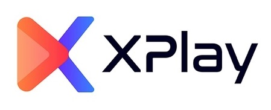

# XPlay

XPlay is a platform to watch interactive movies and enjoy watch parties across friends.

It is designed to attract various users from the video game and movie industry. XPlay is a platform where one or more viewers can interact with the film and influence the events that unfold in the film.

XPlay allows users to watch interactive movies on Smart Devices, with ease.

## Table of Contents
1. [Demo](#demo)
2. [Installation](#installation)
3. [Technology Stack](#technology-stack)
4. [Authors](#authors)
5. [Licence](#licence)

## Demo

[XPlay - Watch interactive movies](https://p3-xplay.netlify.app/home)

#### Guest Login -

guest@xplay.com : Secure123

## Installation

This project has a Node JS backend located here - https://github.com/pesto-students/xplay--backend-team1_sai-chaitanya

Running this project locally is very easy and quick, just follow the below steps -

In the project directory, you can run:

### `yarn install`

Installs the required dependencies

### `yarn start`

Runs the app in the development mode.\
Open [http://localhost:3000](http://localhost:3000) to view it in your browser.

The page will reload when you make changes.\
You may also see any lint errors in the console.

### `yarn test`

Launches the test runner in the interactive watch mode.\
See the section about [running tests](https://facebook.github.io/create-react-app/docs/running-tests) for more information.

### `yarn build`

Builds the app for production to the `build` folder.\
It correctly bundles React in production mode and optimizes the build for the best performance.

The build is minified and the filenames include the hashes.\
Your app is ready to be deployed!

***NOTE: Please checkout develop branch to run locally.***

### System Requirements

Following system requirements need to be met in order for this application to run -

-   Node.js v16.0 or later

-   Any common desktop OS including MacOS, Windows, and Linux is supported

### Environment

Following environment variables need to be set for the application to run -

-   `REACT_APP_API_BASE_URL`: API Server URL

-   `REACT_APP_OKTA_LOGIN_REDIRECT_PATH`: Login redirect URL which is configured on Okta App

-   `REACT_APP_OKTA_CLIENT_ID`: Client ID of an Okta App

-   `REACT_APP_OKTA_ISSUER`: Issuer URL generated for an Okta App

-   `REACT_APP_OKTA_ORG_URL`: Org URL generated for an Okta App

-   `REACT_APP_OKTA_SCOPES`: Optional, the scopes for the Okta API response

-   `REACT_APP_SENTRY_DSN`: A Sentry DSN for error logging

-   `REACT_APP_SOCKET_URL`: Socket Server URL

***NOTE: .env-sample in project root also has complete list of environment variables used.***

<!-- ## Designs

### HLD:

-   [XPlay HLD on Miro](https://miro.com/app/board/uXjVPI_6KK8=/)

### PRD:

-   [XPlay PRD on Slite](https://tusharwalzade.slite.page/p/OfXnNzLq0T3ct2/XPlay-PRD)

### Wireframes:

-   [XPlay Wireframes for Desktop - Figma](https://www.figma.com/file/n1vnT5S3d5UBiqxmmzrP4B/XPlay?node-id=0%3A1)

-   [XPlay Wireframes for Mobile - Figma](https://www.figma.com/file/n1vnT5S3d5UBiqxmmzrP4B/XPlay?node-id=228%3A390) -->

## Technology Stack

-   Frontend - React, Redux

-   Deployment - Netlify, CI/CD

-   Authentication - Okta

-   Logging - Sentry

-   Tools - Version Control System (GIT), Github, Cloudinary

## Authors

-   [Tushar Walzade](https://github.com/tusharwalzade216)

-   [Suresh Kumar](https://github.com/sureshmaverick)

Credits/ Guidence

-   [Sai Chaitanya Ramineni](https://github.com/sairamin)

## Licence

This project is developed under [MIT License](LICENSE.txt)
